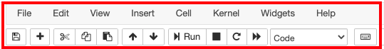
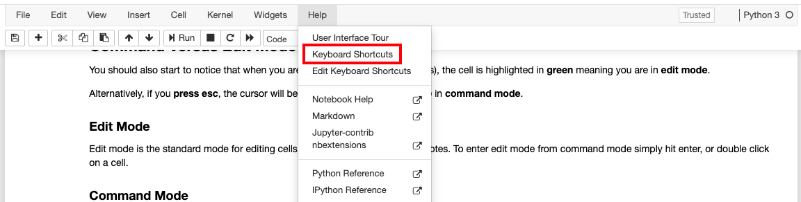
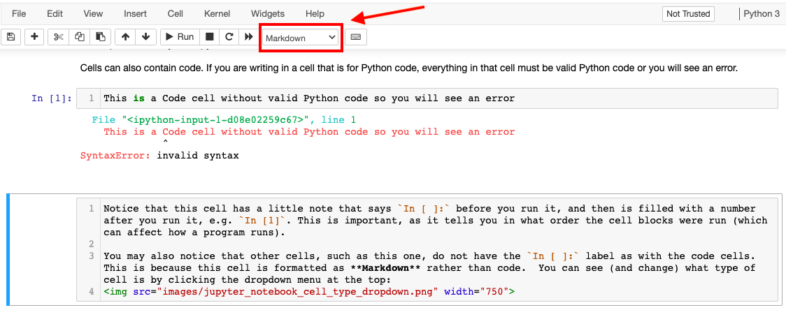
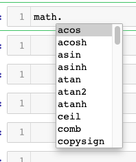
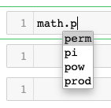
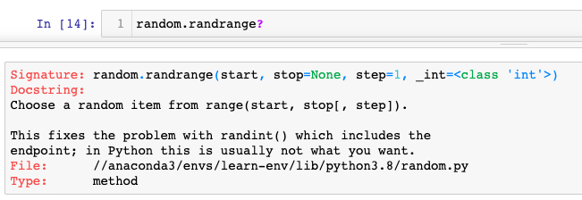
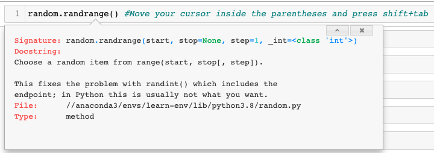

# Your First Jupyter Notebook!

## Introduction

Welcome to your first Code Lesson!

*Reminder: Code Lessons are mainly asking you to read and execute code, not to write it yourself. They are categorized as "Assignments" due to the naming conventions of Canvas + Saturn Cloud, but there is nothing you need to turn in or submit. Just make sure you click the "Mark as done" button in Canvas (so it says "Done") when you're finished*

## Objectives
You will be able to:
* Understand some basic Jupyter Notebooks operations
* Perform cell operations within Jupyter Notebooks
* Import modules and write code in Jupyter Notebooks

## Jupyter Notebooks


The document you are currently reading is a Jupyter Notebook!

Jupyter Notebooks (historically called IPython Notebooks) will be our primary tool for curriculum delivery, and you will use and create many Jupyter Notebooks in the course of this program and in your career as a data scientist.

Jupyter is a web application that allows you to create and work with documents that have live code.  It's a very popular tool among data scientists, as it allows for both explanations of thinking behind code as well as the code itself.

## Running Jupyter Notebooks

Eventually you will set up your local development environment and run the server behind Jupyter Notebook on your personal computer, but for now all you need to worry about is clicking the "Click Here to Launch Lesson" button like you did to open this lesson:


This creates a copy of the notebook from our curriculum for your personal use, which you are free to edit and modify. Your copied notebook will be stored in Saturn Cloud for the duration of the program, with your changes saved.


## Introduction to Cells

The notebook itself consists of **cells**. Double click on this content in Jupyter Notebook to see what we mean. Once you double click on a cell, you are in **edit mode** (also known as *insert mode*). This means that you are able to edit the cells, just as you would if this were a word document. You can tell that you are in insert mode because of the green border around the cell.  

After entering insert mode for this cell, change some content. Don't worry about what you change as you can always undo it. You can revert the changes to a cell by making sure that you are still in edit mode and by pressing `command + z` on a Mac or `control + z` on Windows.

When you're done editing this cell, go ahead and press `shift + enter`.

### Command Versus Edit Mode

As we just saw, when you are in a cell writing code or notes, the cell is highlighted in **green** meaning you are in **edit mode** (AKA insert mode). 

Alternatively, if you are not in edit mode, the cell is highlighted in **blue** indicating that you are in **command mode** (AKA escape mode).

#### Edit Mode
Edit mode is the standard mode for editing cells, whether it's writing code or notes.

To enter edit mode from command mode, you can:

- Double-click on a cell, or
- Press `enter` while a cell is highlighted blue

#### Command Mode
In command mode, you can delete cells, add cells, copy cells, paste cells, change cell types, and more.

To enter command mode from enter mode, you can:

- Press `shift + enter` to run the cell (either rendering the text or running the code), or
- Press `esc` if you only want to enter command mode, without running the cell

You can perform command mode commands with keyboard shortcuts, or in a more cumbersome (and time consuming) manner by using the various headers in the menu bar at top.



#### Keyboard Shortcuts

You can see a full list of shortcuts available in command and edit mode under the help menu.



There is (of course) also a shortcut to view shortcuts! Press the key `h` while in escape mode to view the menu for all of Jupyter's shortcuts.

### Types of Cells

The current cell and every cell before it in this lesson is a markdown cell, meaning that it allows us to write text and stylize that text. For example, if you surround some text with two asterisks (`**`) on both sides, the text **becomes bold**. That's markdown.

The details of markdown are not important here but just know you can use markdown cells to display text. They are really useful for embedding notes and explanations in your Jupyter Notebook.

Cells can also contain code. If you are writing in a cell that is for Python code, everything in that cell must be valid Python code or you will see an error.

Click on the following cell, then press `shift + enter` to execute:


```python
This is a Code cell without valid Python code so you will see an error
```

Notice that this cell has a little note that says `In [ ]:` before you run it, and then is filled with a number after you run it, e.g. `In [1]`. This is important, as it tells you in what order the cell blocks were run (which can affect how a program runs).

You may also notice that other cells, such as this one, do not have the `In [ ]:` label as with the code cells. This is because this cell is formatted as **Markdown** rather than Code.  You can see (and change) what type of cell it is by clicking the dropdown menu at the top:


A cell must either be of type Markdown or of type Code, in which case all of the contents must be valid Python.  It cannot be both.

Instead of using the dropdown, we can quickly change a cell from markdown to code with some keyboard shortcuts.

* From command mode, you can change a cell to type Code by pressing the letter `y`
* From command mode, you can change a cell to type Markdown by pressing the letter `m`

### Adding Cells

You can add cells with either the graphical menu or keyboard shortcuts.

To add a new cell with the graphical menu, click the `+` icon below and to the right of the File menu option.

To add a new cell using keyboard shortcuts: 

* Make sure you are in command mode, not edit mode
    * *Remember you can tell you are in edit mode when you have a green border around the cell*
    * To get out of edit mode, press `shift + enter` or `esc`
    * You will no longer see a cell bordered in green 
* Then press the letter `a` to create a new cell above or `b` to create a new cell below

Anytime you create a new cell, say with the shortcut key `b`, the new cell will default to type Code.  You can switch to command mode and press the letter `m` to change the cell from Code to Markdown.

### Deleting cells

You can also delete cells with either the graphical menu or keyboard shortcuts.

To delete a cell with the graphical menu, make sure it is selected (either command mode or edit mode) then select Edit --> Delete Cells.

To delete a cell using keyboard shortcuts:

* You once again should be in command mode
* Then press the `x` key.

Of course, you'll want a way to undo your deletion.  From command mode, you can press `z` to undo deletion of a cell.

(Note that this is different from `cmd + z`.  Pressing `cmd + z` while in edit mode undoes any changes inside of a cell, whether these changes be deletions or text insertions.  Pressing `z` from command mode undoes the deletion of a cell.)

Try it out:
* Go to command mode, select the below cell, and press `x`. The cell disappears!
* Then bring it back with `z`.

Delete this cell

## Working with Python in Jupyter

Ok, now that you know a little bit about adding and deleting cells, as well as changing cell types from markdown to code, let's focus on working with Python in Jupyter.  We'll go into a large amount of detail about working with a Jupyter Notebook in Python, but the main takeaway is this: if you see a Python cell, you should press `shift + enter` to execute that cell. 

The major gotcha in working with Python code is that we must execute the cells in order for Python to register the code in them. So for example, just seeing the cell where we define `name` to `'bob'` below does not write that cell to memory.


```python
name = 'bob'
```

If we try to reference that variable later on without having executed the cell, Python will tell us that it is not defined.  


```python
name
```


    ---------------------------------------------------------------------------

    NameError                                 Traceback (most recent call last)

    <ipython-input-1-9bc0cb2ed6de> in <module>
    ----> 1 name
    

    NameError: name 'name' is not defined


To execute or run a cell, we must press `shift + enter` on that cell (or when that cell is selected). Upon running a cell, Python will show the the last line of the cell's return value underneath.  Let's run the cell below to see this:


```python
age = 14
age
```

As you can see the variable `age` is set to 14, so when the cell is run `14` is displayed underneath.

One tricky thing to note is that assignment, the action of assigning a variable, **does not** have a return a value.  So, even though the cell is run, if the last line of cell is the assigning of a variable, nothing is displayed underneath. 


```python
hometown = 'NYC'
```

Notice, even after pressing shift + enter on the code above, nothing is displayed below.  But if we reference the variable `hometown`, we see that the cell was run as the variable was defined.


```python
hometown
```

> Yes, it's pretty confusing, but the important thing to take away is that we need to run our cells with Python code by pressing `shift + enter` if we want Python to read our variables and functions and remember them later on. Remember, in the case of assignment, the return value is `None`, which does not show an output. We can see this more concretely below by running the cell below:


```python
None
```

If you want to print a certain sentence, you need to use the command `print()` and whatever you want to print in quotes, just like this:


```python
print('I want to print this sentence about running Python code')
```

As you can see, running the code above printed text to the screen. As we'll cover in more depth later, `print` is an example of a "function". Functions are blocks of reusable code that execute a particular task. When functions are associated with a specific object they are called "methods." Don't worry about the details right now, you will learn more about functions and methods later.

### Importing Modules

The next thing we're going to do is load in some Python modules that will be part of our toolbox for manipulating and analyzing data. Again, don't worry if you are not sure what a Python module is. For now, just think of modules as collections of specialized tools for performing specific tasks.

For the purpose of this example, we'll use the built-in Python [`random`](https://docs.python.org/3/library/random.html) and [`math`](https://docs.python.org/3/library/math.html) modules.

Again, press **`shift + enter`** to run the code below

(If you ever get a `NameError`, e.g. `name 'random' is not defined`, that usually means you forgot to run the cell to import the required tools.)


```python
import random
import math
```

Here's a short example of code that uses imported modules (don't worry about the details of what it's doing or why):


```python
# set a seed for reproducibility
random.seed(42)

# get a single random number
random_number = random.random()
random_number
```


```python
# create a list of 5 random floating point numbers
random_numbers = [random.random()*10 for x in range(5)]
random_numbers
```


```python
len(random_numbers)
```


```python
# find the ceilings of the random numbers
# (ceil(x) = the smallest integer >= x)
ceilings = [math.ceil(x) for x in random_numbers]
print(ceilings)
```

### Python Comments

Note the green text following the pound sign `#`.  

Anything following a `#` in Python is a comment and will *not* get executed. This is a useful feature for annotating your code with notes for yourself and others so that your code is easy to read.

When you create a notebook, you want to use a mixture of markdown cells and Python comments to explain what is happening. In general, markdown cells are useful for headers, longer explanations, and non-technical or business-oriented notes. Python comments are useful for shorter details that are more specifically related to the code implementation. There isn't a hard-and-fast rule of what to write in what format, but in general:

* If a code comment spans multiple lines, it should probably be a markdown cell instead
* If a markdown cell is describing something that's only relevant to a single line within a code cell, it should probably be a code comment instead

### Using Jupyter Notebook to View Module Documentation

One of the most useful features of Jupyter Notebook is the ability to bring up documentation for a given tool without leaving the notebook.

A little more theory and context:

When we loaded in modules in a previous cell (using the `import` commands), we loaded code into memory. That code included functions, variables, and other objects. Collectively, all of these items are loaded under the package name or alias.

We demonstrated this when we used the modules above, e.g. `random.random()`

This also demonstrates the **dot notation** in Python, which is how we access built in methods or attributes of a given object.

#### Tab Completion

When code is loaded into a Jupyter Notebook, we can also use **tab completion** to preview methods available in modules or other objects.

**Try This Out Yourself**

1. In the cell below, navigate your cursor to the right of **`math.`**
2. Press `tab` to see a list of available methods/attributes




```python
math.
```

You can also start typing to subset the list of available commands:



```python
math.p
```

#### Pulling up Docstrings

Even better, you can even see how a method works by pulling up its **docstring**! You can do this by writing `?` after the method and running the cell.



Try it out by running the following cell:


```python
random.randrange?
```

Alternatively, you can pull up a preview of the docstring by pressing **shift+tab within the parentheses of a method**



Try it out here:


```python
random.randrange() #Move your cursor inside the parentheses and press shift+tab
```

### Variables

The other thing that happened in our code example above was that we defined **variables**.  

For example, this happened in this line of code:  
> ```random_number = random.random()```

As we saw, we used the `random` method from the `random`, module which we imported previously.

The output of this method was then assigned to the variable `random_number`. This is the standard syntax for declaring any variable. You do not have to specify variable types, as in many other programming languages. Simply: 

> `variable_name = what_to_store_in_the_variable`

### Built-in Python Functions

We also used two built in Python functions:  
- `len() #Returns the length of an object`
- `print() #Prints stuff!`

In general, **Python has reserved keywords** for built in functions like this. **Be sure to not name your variables any of these!**


You can also check what type of object something is using the built in `type()` method. This can be useful when determining how to work with an object that you are unfamiliar with.


```python
type(ceilings)
```

## Practice

1. Immediately below this cell, create a new code cell
2. In that code cell, create a variable called `pi` that is assigned to `math.pi`. Write `pi` again at the bottom so you can see the result, and run the cell
3. Make another code cell, and use the built-in `int` method to convert `pi` to an integer.  In other words, enter `int(pi)` in the new cell

These are just suggestions, feel free to explore other methods of `math` or `random`, or other built-in functions! It's also a good idea to practice tab completion as well.

As a reminder, this is not an assignment you need to turn in, just make sure you click "Mark as done" on Canvas when you're done reading.

<table>
    <tr>
        <td>
            
        </td>
        <td>
            -->
        </td>
        <td>
            
        </td>
    </tr>
</table>

## Summary

Congratulations, you got some practice executing cell operations within Jupyter Notebooks and learned how to import Python modules. We will use this format consistently through the rest of the curriculum, as we learn about everything from data visualization to machine learning. Now let's dive into some more Python fundamentals!
